# linxu命令合集

### 1.ls

`ls` 是英文单词 `list` 的缩写，其功能就是列出指定目录下的内容及其相关属性信息。默认状态下，`ls` 会列出当前目录的内容。而带上参数后，我们可以用 `ls` 做更多的事情。

用法：ls

| 参数 |                     详解                      |
| :--: | :-------------------------------------------: |
|  -a  | 显示所有文件及目录（包括以"."开头的隐藏文件） |
|  -l  |         使用长格式列出文件及目录信息          |

### 2.mkdir

```
mkdir [参数] [目录]
```

`mkdir` 是 `make directories` 的缩写，用来创建目录。默认情况下，如果要创建的目录已经存在，则提示已存在，而不会继续创建目录。`mkdir` 命令可以同时创建多个目录。

``` c
# 创建test目录
mkdir test

# 递归创建目录，A也是一个目录
mkdir -p test/A

# 同时创建多个目录
mkdir test1 test2 test3

# 创建目录，并赋予755权限，即属主有读写执行
mkdir -m 700 test
```

### 3.touch

语法格式：touch [参数] [文件]

`touch` 命令有两个功能，一是创建新的空文件；二是改变已有文件的时间戳属性。在修改文件时间属性时，用户必须是文件的属主，或拥有写文件的访问权限。

``` c
# 创建文件test.py
touch test.py

# 也可以批量创建，要求文件名有一定的规律，比如test1.py、test2.py、test3.py
touch test{1..3}.py

# 修改文件的访问时间，可以通过命令stat来查看
touch -a test.py
```

### 4.cat

语法格式：cat [参数] [文件]

`cat` 命令用于查看纯文本文件的内容，针对内容较少的文件。大文件的查看方式，后面会介绍到。

``` c
# 查看文件test.py的内容，并显示行号
cat -n test.py
```

如果系统中没有任何的编辑器，也可以使用 `cat` 来编辑文件

``` c
# 如果是追加内容的话，使用 >>，EOF是结束标记
cat > test.py << EOF
> import os
> print('Hello Python.')
> EOF
```

### 5.cp

`cp` 命令是英文单词 `copy` 的缩写，它的作用就是复制文件或目录。

`cp` 命令可以将多个文件复制到一个具体的文件名或一个已经存在的目录下，也可以同时复制多个文件到一个指定的目录中。

语法格式：cp [参数] [源] [目标]

``` c
# 复制文件夹dir1到dir2下
cp -R dir1 dir2/

# 复制多个文件到目录dir下
cp test1.py test2.py test3.py dir

# cp还可实现文件或文件夹重命名的效果
cp test1.py test2.py

# 针对动态链接库，需要保持原来的软链接关系
cp -a libopencv*.so /lib/
```

### 6.echo

`echo` 命令用于输出字符串或者变量的值。最常见的是通过它来查看系统变量的值。

语法格式： echo [参数] [字符串]

``` c
# 输出字符串
echo "xugaoxiang.com"

# 查看变量的值
echo $PATH

# 使用``来执行其它命令，如date
echo `date`
```

### 7.pwd

`pwd` 命令是 `print working directory`中每个单词的首字母缩写，功能为打印工作目录，即显示当前工作目录的绝对路径。

切换目录是 `linux` 中最常用的操作，为了防止 **迷路** ，我们可以使用 `pwd` 命令快速查看当前我们所在的目录。

语法格式: pwd [参数]

```
# 显示当前路径
pwd
```

### 8.mv

`mv` 命令是 `move` 单词的缩写，<u>可以实现文件的移动和重改名</u>。

语法格式：mv [参数]

```
# 移动位置
mv test.py /opt/

# 重命名
mv test.py test1.py
```

### 9.rm

`rm` 的作用是删除文件或文件夹，这个命令使用的时候要非常小心，尤其是新手。

语法格式：rm [参数] [文件]

```
# 删除test.py
rm test.py

# 删除前询问
rm -i test.py

# 强制删除，对于新手，不建议使用参数f，除非清楚知道自己在干嘛
rm -f test.py

# 删除文件夹
rm -r dir

# 删除文件夹下的所有文件，使用通配符
rm -rf dir/*
```

### 10.cd

`cd` 是 `change directory` 的缩写，意思就是进入到另一个目录，它是命令行中最常用的操作。这里的目录可以是绝对路径(如 `/usr/lib`)，也可以是相对路径(如 `../../`)

语法格式：cd [参数] [目录名]

```
# 切换到目录/var/www
cd /var/www

# 切换到父目录
cd ../

# 回到我的主目录
cd ~

# 回到切换前的目录，比如从目录A切换到目录B，执行命令后，就是回到目录A，对于目录特别深的场景，非常方便
cd -
```

### 11.df

`df` 命令是 `disk free` 的缩写，用于显示系统上可使用的磁盘空间，默认的显示单位为 `KB`，常使用参数 `-h` ，数据更利于阅读和理解

语法格式： df [参数] [指定文件]

```
df -h
```

```
# 显示文件系统类型为ext4的磁盘使用情况
df -ht ext4
```

### 12.du

`du` 是 `Disk Usage` 的缩写，用于查看磁盘占用空间。与 `df` 命令不同的是，`du` 命令是对文件和目录磁盘使用的空间的查看，而不是某个分区。

语法格式：du [参数] [文件]

```
# 显示指定文件所占空间
du -sh file
```

```
# 显示文件夹内所有文件大小
du -sh dir
```

```
# 显示文件夹内所有文件的大小
du -ah dir/
```

### 13.fdisk

`fdisk` 是磁盘的分区工具。通过它可以进行硬盘的分区操作，如创建、删除、格式化等，使用这个命令需要特别小心，同时它也是需要管理员权限的。

语法格式：fdisk [参数]

```
# 查看所有分区情况，包括多个磁盘
sudo fdisk -l
```

```
# 操作某个磁盘
sudo fdisk /dev/sda
```

输入 `m`，可以查看对应的指令

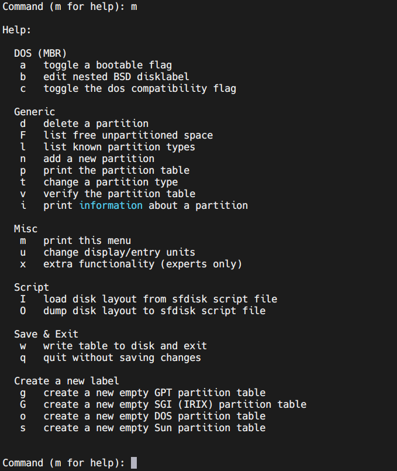

常见的如，`n` 创建分区，`t` 修改分区类型，`d` 删除分区，`w` 保存修改并退出，`q` 不保存修改退出

### 14.head

`head` 命令用来显示文件的内容，和 `cat` 类似，不接参数时默认打印文件的前10行。

语法格式：head [参数] [文件]

```
# 默认显示
head test.txt

# 显示文件的前20行
head -n 20 test.txt

# 显示文件的前20个字符，注意和行的区别
head -c 20 test.txt
```

### 15.tail

`tail` 命令用于显示文件尾部的内容，和 `head` 命令对应。不接参数时默认在屏幕上显示指定文件的最后10行。

语法格式：tail [参数]

```
# 默认显示
tail test.txt

# 显示文件的最后20行
tail -n 20 test.txt

# 显示文件的最后20个字符
tail -c 20 test.txt

# 显示从第20行到结尾的内容
tail +20 test.txt

# 同时显示多个文件，内容之间会显示所属文件名
tail test1.txt test2.txt test3.txt

# 如果是一个不断更新的文件，像日志，可以指定每次显示文件的最后几行，方便查看
tail -f 20 test.txt
```

### 16.mount

`mount` 命令用于挂载文件系统到指定的加载点（也就是目录）。常用于服务器版中挂载 `U` 盘和使用网络文件系统 `NFS`。

语法格式：mount [参数]

```
# 查看所有挂载
mount

# 将sdb设备的第一个分区挂载到/mnt目录下。如果系统中只有一块硬盘，接入u盘后，一般sdb1就是u盘，可以查看/dev/下的设备节点来确认
mount /dev/sdb1 /mnt

# 指定文件系统类型
mount -t ext4 /dev/sda5 /tmp

# 挂载nfs
mount -t nfs 192.168.1.100:/nfs /tmp
```

### 17.ping

`ping` 命令主要用来测试主机之间网络的连通性。`ping` 使用的是 `ICMP` 传输协议。

语法格式：ping [参数] [目标主机]

```
# 基本使用，ip也可以换成域名或主机名
ping 192.168.1.100

# 设置ping的次数
ping -c 10 192.168.1.100

# 设置ping的次数及间隔，单位是秒
ping -c 10 -i 2 192.168.1.100
```

### 18.history

`history` 命令用于显示用户以前执行过的历史命令，还能对历史命令进行追加和删除等操作。历史命令会被写入本地文件 `~/.bash_history` 中。

语法格式: history [参数] [目录]

```
# 显示所有历史命令
history

# 显示最近5条历史命令，包括本条history命令在内
history 5

# 清空历史命令
history -c 

# 将当前Shell会话的历史命令追加到命令历史文件中
history -a
```

### 19.tar

`tar` 命令的作用是为文件和目录创建档案，就是我们常说的打包。这里需要注意，打包是打包、压缩是压缩。

语法格式：tar [参数] [文件或目录]

```
# 将当前文件夹下的jpg文件打包
tar -cf images.tar *.jpg

# 打包后删除jpg文件
tar -cf images.tar *.jpg --remove-files

# 列出包内的文件
tar tf images.tar

# 提取包内的文件
tar xf images.tar

# 将test.jpg从包中删除
tar --delete -f images.tar test.jpg

# 打包后，使用gzip进行压缩
tar -zcvf images.tar.gz *.jpg

# 打包后，使用bzip2进行压缩
tar -cjf images.tar.bz2 *.jpg
```

### 20.find

`find` 命令可以根据给定的路径和表达式来查找文件或目录。它的参数有很多，而且支持正则表达式，结合管道命令可以实现复杂的功能。

语法格式：find [参数] [路径] [查找和搜索范围]

```
# 在当前目录下查找文件test.py
find . -name test.py

# 在当前目录下查找文件test.py，忽略大小写
find . -iname test.py

# 查找/tmp目录下大于1M的文件
find /tmp -size +1M

# 查找/home目录下以.jpg结尾的文件，忽略大小写
find /home -iname *.jpg
```

### 21.ssh

`ssh` 命令是 `openssh` 套件中的客户端连接工具，可以实现对服务器的远程管理，服务器端默认使用端口22。

语法格式: ssh [参数] [远程主机]

```
# 以当前系统用户登录远程主机
ssh 192.168.1.100

# 指定用户登录远程主机
ssh -l test 192.168.1.100
# 或者
ssh test@192.168.1.100

# 指定远程端口登录
ssh -p 1024 root@192.168.1.100
```

常见的 `ssh` 客户端工具有 [`putty`](https://www.putty.org/)、 [`mobaxterm`](https://mobaxterm.mobatek.net/)

### 22.scp

`scp` 是 `secure copy` 的缩写，是 `linux` 系统下基于 `ssh` 登陆进行安全的远程文件拷贝命令，它可以在 `linux` 服务器之间复制文件和目录。

语法格式：scp [参数] [文件]

```
# 将当前目录下的test.py拷贝到远程主机/home目录下
scp test.py root@192.168.1.100:/home

# 将当前目录下的文件夹test拷贝到远程主机/home目录下
scp -r test root@192.168.1.100:/home

# 从远程主机拷贝文件到本地
scp root@192.168.1.100:/home/test.py .

# 从远程主机拷贝文件夹到本地
scp -r root@192.168.1.100:/home/test /tmp

# 使用非标准ssh端口拷贝
scp -P 1024 test.py 192.168.1.100:/home/xgx/
```

### 23.telnet

`telnet` 命令和 `ssh` 类似，也可以登入远程主机，同样需要远程主机开启对应服务，默认使用的端口是23。

语法格式： telnet [参数]

```
# 登录远程主机
telnet 192.168.1.100

# 也可以用来测试远程主机相应端口是否开启
telnet 192.168.1.100 8080
```

### 24.uname

`uname` 命令用于显示系统相关信息，比如主机名、内核版本号、硬件架构等。

语法格式：uname [参数]

```
# 显示主机名
uname -n

# 显示内核信息
uname -r

# 显示硬件架构信息
uname -i

# 显示所有信息
uname -a
```

### 25.hostname

`hostname` 命令用于显示和设置系统的主机名称。环境变量 `HOSTNAME` 也保存了当前的主机名。不过在使用 `hostname` 命令设置主机名后，系统重启后还是原来的主机名。如果需要永久修改，需要同时修改文件 `/etc/hostname` 和 `/etc/hosts`。

语法格式：hostname [参数]

```
# 显示主机名
hostname

# 显示主机的ip地址
hostname -i

# 修改主机名为test
hostname  test
```

### 26.whoami

`whoami` 命令是打印出当前系统内登录的用户名。

语法格式：whoami [参数]

```
# 查询登录的用户名
whoami 
```

### 27.ifconfig

`ifconfig` 命令用于查看和配置网络参数。使用 `ifconfig` 命令配置的信息，在网卡重启或机器重启后，配置就不存在。要想永远保存，就需要修改网卡的配置文件了。

语法格式：ifconfig [参数]

```
# 显示全部网络信息
ifconfig
```

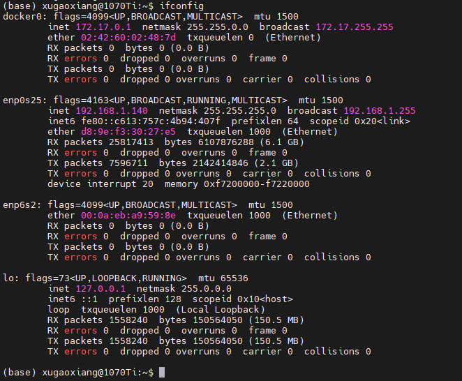

```
# 查看指定网卡
ifconfig enp0s25
```

```
# 关闭网卡eth0
ifconfig eth0 down

# 启动网卡eth0
ifconfig eth0 up 

# 设置ip地址
ifconfig eth0 192.168.1.100

# 设置ip和子网掩码
ifconfig eth0 192.168.1.100 netmask 255.255.255.0
```

### 28.grep

`grep` 的意思是全面搜索正则表达式，是强大的文本搜索工具，用于过滤和搜索特定字符，也是使用最为广泛的命令了。

语法格式： grep [参数]

```
# 在文件中搜索字符串
grep "putText" motion_detector.py

# 在多个文件中搜索
grep "putText" test1.py test2.py test3.py
```

### 29.netstat

`netstat` 命令用于显示各种网络相关的信息，如网络连接，路由表，接口状态等。

语法格式：netstat [参数]

```
# 显示详细的网络信息
netstat -a
```

```
# 显示网卡列表
netstat -i
```

```
# 显示路由表
netstat -r
```

### 30.less

`less` 命令用于显示文件或命令输出的内容，它一次只显示一个页面，不过允许在文件中向前和向后导航。命令主要用于打开大文件，它不会读取整个文件，相比于其它文本编辑器，加载时间会更快。

语法格式：less [参数] [文件]

```
# 查看文件
less test.py

# 查看时显示行号
less -N test.py

# 查看命令历史并通过less分页显示
history | less
```

进入到 `less` 后，可以使用下面命令进行导航

- 下箭头、回车、`e`、或者 `j`，前进一行
- 上箭头 ， `y` 或 `k`，向后移动一行
- 空格或者 `f`，向前移动一页
- `b`，向后移动一页
- `/pattern`，向前搜索匹配模式
- `? pattern`，向后搜索匹配的模式
- `n`，重复上一次搜索
- `N`，反向重复上一次搜索
- `g`，转到文件的第一行
- `Ng`，转到文件中的第 `N` 行
- `G`，转到文件的最后一行
- `p`，转到开头
- `h`，显示帮助
- `q`，退出

### 31.tree

`tree` 命令是用于以树状图形式列出目录的内容。

语法格式：tree [参数]

```
tree
```

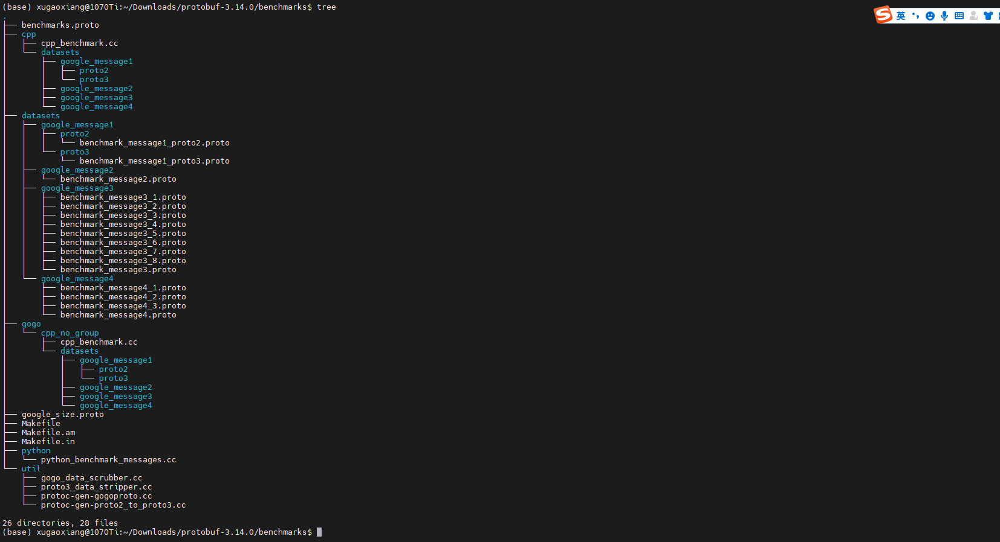

```
# 只显示2层目录
tree -L 2
```

```
# 只显示目录，不显示文件
tree -d
```

```
# 根据目录和文件的更改时间来排序
tree -t 
```

### 32.export

`export` 命令用于显示和设置系统的环境变量。

语法格式： export [参数]

```
# 列出当前所有变量
export

# 过滤PATH
export | grep PATH

# 设置变量ENVI
export ENVI=100

# 常见的追加环境变量的值，如PATH
export PATH=/home/xugaoxiang/bin:$PATH
```

### 33.dpkg

`dpkg` 命令是 `Debian Linux` 系统中用来安装、创建和管理软件包的工具。

语法格式：dpkg [参数]

```
# 安装软件包
dpkg -i test.deb

# 显示已安装的软件包
dpkg -l 

# 显示软件包中的内容
dpkg -c test.deb

# 删除软件包
dpkg -r test.deb
```

### 34.wget

`wget` 命令用来从指定的 `URL` 下载文件，它非常稳定，支持 `HTTP`、`HTTPS`、`FTP`等多种网络协议，还支持代理。

语法格式： wget [参数]

```
# 下载文件
wget https://xugaoxiang.com/package.zip

# 下载，保存为test.zip
wget -O test.zip https://xugaoxiang.com/package.zip

# 断点续传
wget -c -O test.zip https://xugaoxiang.com/package.zip
```

### 35.usermod

`usermod` 命令用于修改用户账号。

语法格式：usermod [参数]

```
# 更改用户登录的目录，如以xugaoxiang登录系统，会进入到目录/home/test
usermod -d /home/test xugaoxiang

# 修改用户名，从xugaoxiang到test
usermod -l test xugaoxiang
```

### 36.passwd

`passwd` 命令用于设置用户的认证信息，操作需要管理员权限。

常用格式：passwd [参数]

```
# 修改当前用户的密码
passwd

# 修改root的密码
passswd root

# 锁定用户密码，不允许修改
passwd -l xugaoxiang

# 解除锁定
passwd -u xugaoxiang

# 清除密码
passwd -d xugaoxiang

# 下次登录修改密码
passwd -e xugaoxiang
```

### 37.useradd

`useradd` 命令用来创建新的用户或更改用户的信息。创建的帐号，保存在 `/etc/passwd` 文件中。

语法格式：useradd [参数] [用户名]

```
# 创建新的账号xugaoxiang
useradd xugaoxiang

# 创建账号，但不创建其HOME目录，也就是/home/xugaoxiang，同时禁止登录
useradd -M -s /sbin/nologin xugaoxiang

添加新用户，指定UID为666，指定用户组为root，toor成员，指定shell类型为/bin/sh
# useradd -u 666 -s /bin/sh -G root,toor xugaoxiang
```

### 38.userdel

`userdel` 命令用于删除指定的用户及与该用户相关的文件。同时，也修改了系统的用户账号文件 `/etc/passwd`、`/etc/shadow` 以及 `/etc/group` 文件。

语法格式：userdel [参数] [用户名]

```
# 删除账号xugaoxiang
userdel xugaoxiang

# 删除用户，同时将其家目录一起删除，/home/xugaoxiang
userdel -r xugaoxiang

# 强制删除用户
userdel -f xugaoxiang
```

### 39.chmod

`chmod` 命令用来改变文件或目录的权限，只有文件的属主和超级用户才能执行这个命令。有两种设置模式，一种是采用权限字母和操作符；另一种是采用数字。

语法格式： chmod [参数] [文件]

```
# 给test.sh脚本加个执行的权限，a为针对所有用户。r为读，w为写，x为执行
chmod a+x test.sh

# 给文件夹test递归设置权限755，读权限为4，写为2，执行为1，加起来是7
chmod -R 755 test
```

### 40.chown

`chown` 命令用来改变文件或文件夹的所属用户及用户组，只有超级管理员才有权限执行。

语法格式：chown [参数]

```
# 将test.py文件的用户组和用户都改为xugaoxiang，冒号前的是用户，冒号后的是用户组，很多时候它们的名称是一样的
chown xugaoxiang:xugaoxiang test.py

# 递归修改文件夹
chown -R root:root test
```

#### 41.source

`source` 命令通常用于执行刚修改的初始化文件，使之立即生效，比如环境变量。

语法格式：source [文件]

```
# 很多时候，我们安装过一些基础软件，会设置一些环境变量，像PATH，通常是编辑~/.bashrc，想让变量即刻生效，就可以使用source
source ~/.bashrc
```

### 42.ufw

`ufw`程序用于管理防火墙。相比 `iptables`，使用起来更加简单，默认需要手动安装 `sudo apt install ufw`。

语法格式：ufw [参数]

```
# 启动
ufw enable

# 关闭
ufw disable

# 重启
ufw reload

# 显示防火墙状态及规则
ufw status

# 重置配置
ufw reset

# 允许外部访问80端口
ufw allow 80

# 禁止访问80端口
ufw delete allow 80

# 只允许特定网段访问
ufw allow from 172.21.2.10/24
```

### 43.clear

`clear` 命令用于清除屏幕。本质上是让终端显示页向后翻了一页，如果向上滚动屏幕还是可以看到之前的操作。

语法格式：clear [参数]

```
# 清屏
clear
```

### 44.top

`top` 命令是 `linux` 下常用的性能分析工具，能够实时显示系统中各个进程的资源占用状况。

语法格式：top [参数]

```
# 显示进程信息
top
```

### 45.kill

`kill` 命令用来删除运行中的进程。

语法格式：kill [参数] [进程号]

```
# 删除进程，我们需要知道进程的id，也就是pid，pid可以通过ps命令来查看
# 杀死进程号是2000的进程，发送信号9 SIGKILL，强制杀死
kill -9 2000
```

### 46.killall

`killall` 命令使用进程的名称来杀死进程，而且可以杀死一组同名进程。前一节我们介绍过命令 `kill`，它是通过进程号来杀死进程，如果要找到进程号，需要使用 `ps` 等命令再配合 `grep` 来查找，而 `killall` 则是把这一过程简单化了。

语法格式：killall [参数]

```
# 强制杀死所有的 nginx 进程
killall -9 nginx
```

### 47.ps

`ps` 命令用于显示当前系统的进程状态。它是最基本的同时也是非常强大的进程查看命令，使用它可以确定哪些进程正在运行和运行的状态、进程是否结束、进程有没有僵死、哪些进程占用了过多的资源等。

```
# 列出所有进程
ps -aux

# 过滤nginx进程
ps ax | grep nginx
```

### 48.unzip

`unzip` 命令是用于 `.zip` 格式文件的解压缩工具。

语法格式：unzip [参数] [文件]

```
# 解压到当前目录
unzip data.zip

# 解压到文件夹test
unzip data.zip -d test
```

### 49.whereis

`whereis` 命令用来定位命令的二进制程序、源代码文件和 `man` 手册页等相关文件的路径。它的查找速度非常快，因为它不是在磁盘中查找，而是在一个数据库中查询，这个数据库是 `linux` 系统自动创建的，包含有本地所有文件的信息。

语法格式：whereis [参数] [命令名]

```
whereis ls
```

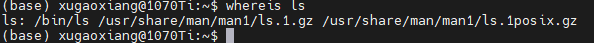

### 50.free

`free` 命令显示系统中物理上空闲和已用的内存，包括交换内存。这些信息是通过解析文件 `/proc/meminfo` 而来的。

语法格式：free [参数]

```
free
```

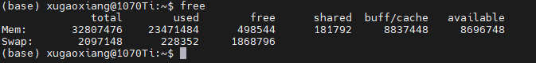

```
# 以MB显示内存使用情况
free -m
```

### 51.ln

`ln` 命令是链接的意思， 功能是为某一个文件创建一个链接。这里的链接有两种，一种是硬链接，另一种是符号链接，也叫软链接。

硬链接是源文件的副本，和源文件一样的大小，但是事实上却不占任何空间。软链接可以理解为 `windows` 中的快捷方式，可以为文件夹创建软链接。

```
# 为文件test.py创建硬链接文件link.py
ln test.py link.py

# 为test.py创建软链接slink.py
ln -s test.py slink.py

# 通过ls -l来查看文件的链接情况
ls -l slink.py

# 删除链接文件
unlink slink.py
```

### 52.wc

`wc` 命令统计指定文件中的字节数、字数、行数，并将统计结果显示输出。

语法格式：wc [参数] [文件]

```
# 统计文件test.txt中的字数
wc -w test.txt

# 统计文件test.txt中的字节数
wc -c test.txt

# 统计文件test.txt中的行数
wc -l test.txt
```

### 53.data

`date` 命令用来显示或设定系统的日期和时间。

语法格式：date [选项] [+输出形式]

```
# 显示当前系统时间
date

# 设置系统时间
date -s "20220320 12:00:00"

# 只设置日期
date -s 03/20/2022

# 只修改时间
date -s 12:00:00
```

### 54.locate

`locate` 命令，功能跟 `find -name` 类似，但是速度要比 `find` 快得多。

语法格式：locate [参数] [文件]

```
locate /etc/em
```

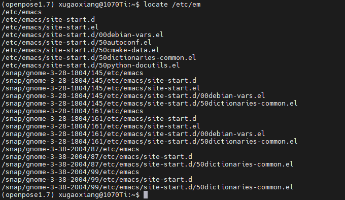

### 55.mkfs

`mkfs` 命令用于磁盘分区的格式化，支持大多数的文件系统格式，如 `vfat`、`ext2`、`ext3`、`ext4` 等。

语法格式： mkfs [参数]

```
# 将sda5分区格式化成ext4格式
mkfs -t ext4 /dev/sda5
```

### 56.pstree

`pstree` 命令将所有进程以树状图显示。

语法格式： pstree [参数]

```
# 显示系统中进程和进程号
pstree -p
```

### 57.who

`who` 命令用来打印当前登录用户的信息，包含了系统的启动时间、活动进程、使用者 `ID`、使用终端等信息，是系统管理员了解系统运行状态的常用命令。

语法格式： who [参数] [选项]

```
# 显示用户登录信息
who
```

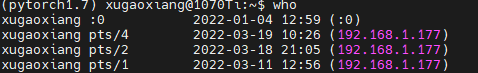

```
# 显示系统最近启动时间
who -b
```

### 58.sudo

`sudo` 是一种权限管理机制，管理员可以授权于一些普通用户去执行一些只有 `root` 才能执行的操作，而不需要知道 `root` 的密码。默认的配置存放在 `/etc/sudoers` 文件中

```
# 切换到root
sudo su

# 列出目前的权限
sudo -l

# 以root权限执行命令ifconfig -a
sudo ifconfig -a
```

### 59.curl

`curl` 是一个文件传输工具，可以上传也可以下载，支持 `HTTP`、`HTTPS`、`FTP` 等市面上常见的协议。后端开发者经常用它来测试 `web` 接口

```
# 获取网站源码
curl https://xugaoxiang.com

# 下载文件
curl -O https://xugaoxiang.com/download/test.jpg

# post上传文件
curl -F ‘data=@path/to/local/file’ UPLOAD_ADDRESS

# 以特定key参数上传文件
curl -F 'longjing=@/home/xugaoxiang/test.jpg' http://192.168.1.99:8888/uploadImageFile

#同时上传多个文件
curl -F 'fileX=@/path/to/fileX' -F 'fileY=@/path/to/fileY' ... http://localhost/upload
```

### 60.lsusb

`lsusb` 命令用于显示本机的 `usb` 设备的详细信息。

语法格式：lsusb [参数]

```
# 显示usb设备列表
lsusb
```

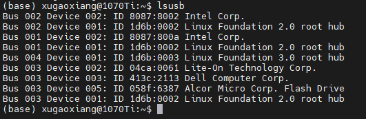

### 61.vi

`vi` 命令用于编辑文本内容，是 `linux` 系统字符界面下最常用的文本编辑工具，能够编辑任何的 `ASCII` 格式文件，包括创建、查找、替换、修改、删除、复制、粘贴等操作，非常强大。

语法格式：vi [参数] 文件

```
# 打开文件
vi test.txt

# 打开文件，并从第10行开始编辑，也就是将光标定位在第10行
vi +10 test.txt
```

另外，在 `ubuntu` 系统中，如果执行了 `sudo apt-get install vim`，那么，`vi` 和 `vim` 就是同一个东西。

### 62.nano

`nano` 是一个字符终端的文本编辑器，它比 `vi/vim` 要简单得多，比较适合 `linux` 初学者使用。

语法格式： nano [参数] [文件]

```
# 打开文件
nano run.sh
```

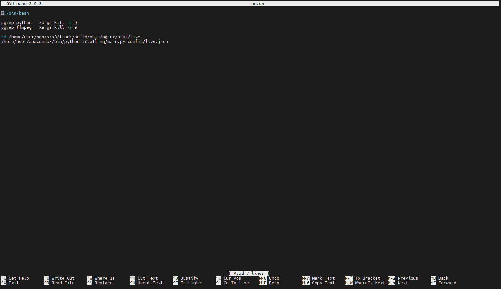

屏幕下方列出了常用操作的快捷键组合提示，`^` 表示 `Ctrl` 键，`M` 表示 `Alt` 键

### 63.man

`man` 命令用于显示帮助信息，是 `manual` 的意思，即帮助手册。在不清楚某个命令时，使用 `man` 是最好的方式，查看的信息也是最标准的。

语法格式：man [参数] 对象

```
# 查看ifconfig的使用帮助
man ifconfig
```

```
# 编号规则：普通命令为1，函数为2，库文件为3，设备为4，配置文件为5，游戏为6，宏文件为7，系统命令为8，内核程序为9，TK指令为10
man 5 passwd
```

### 64.systemctl

`systemctl` 命令用于管理系统服务。较新版本的 `linux` 各发行版初始化进程服务已经由原来的 `init` 换成了现在的 `systemd` 服务，而 `systemd` 服务的管理就是通过 `systemctl` 来完成的。

语法格式：systemctl 参数 服务

```
# 启动服务，比如ssh服务
systemctl start sshd

# 停止服务
systemctl stop sshd

# 重启服务
systemctl restart sshd

# 查看服务的状态
systemctl status sshd
```

### 65.help

`help` 命令的功能是用于显示帮助信息，能够输出 `shell` 内部命令的帮助内容，但对于外部命令则无法使用，可以用 `man` 或 `info` 命令进行查看。

```
#查看cd命令的帮助
help cd

# 输出cd命令的简短帮助信息
help -d cd
```

### 66.stat

`stat` 命令用来显示文件或文件系统的详细信息

语法格式：stat [参数]

```
stat ubuntu-15.10-desktop-i386.iso
```

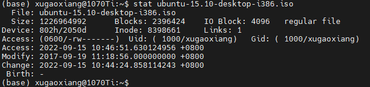

### 67.cal

`cal` 命令用来显示当前日历，是 `calendar` 的缩写。

语法格式：cal [参数 [月份] [年份]

```
# 默认显示当月日历
cal
```

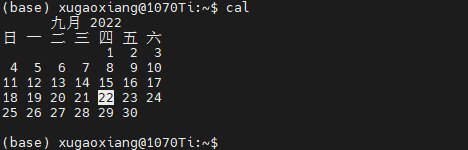

```
# 显示特定年月的日历，如2011年11月
cal 11 2021
```

### 68.logout

`logout` 命令让用户退出系统。

语法格式：logout [参数]

```
# 退出系统
logout
```

### 69.shutdown

`shutdown` 命令是用于关闭系统，作用等同于 `halt` 命令。

语法格式：shutdown [参数]

```
# 立即关闭系统
shutdown -h now

# 立即重启系统
shutdown -r now 

# 10分钟后关机，同时发送消息给登录用户
shutdown +10 "马上关机啦，赶快保存资料，不然一天白忙啦！"

# 设定系统关闭时间也就是定时关机，如20:30
shutdown -h 20:30

# 如果之前设定了定时关机，可以取消
shutdown -c
```

### 70.poweroff

`poweroff` 命令也是用来关闭系统。

语法格式：poweroff [参数]

```
# 关机
poweroff

# 强制关机
poweroff -f
```

### 71.exit

`exit` 命令用于退出终端。在终端中执行 `exit` 默认会直接退出终端。

语法格式：exit [状态值]

```
# 退出终端
exit

# 如果在终端中使用ssh登录了远程的主机，也可以用exit退回到本地
exit
```